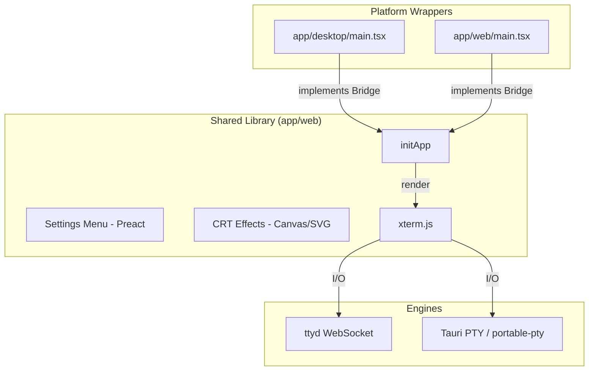

# Application Architecture

## Overview

"Dastardly Dungeon Dwellers" utilizes a unified CRT visual engine built on top of [xterm.js](https://xtermjs.org/). The application is split into a shared frontend library and platform-specific wrappers (Web and Desktop).

### Tech Stack
*   **Frontend Core:** TypeScript, Preact, Preact Signals.
*   **Bundler:** [esbuild](https://esbuild.github.io/) (used for its speed and IIFE/UMD output support).
*   **Terminal:** [xterm.js](https://xtermjs.org/) with WebGL and Fit addons.
*   **Visuals:** SVG Filters (Fractal Noise, Displacement Maps) and Canvas-based Bloom.

---

## Unified CRT Engine (`app/web/`)

The core CRT experience is encapsulated in a shared `initApp` function. This function handles the terminal initialization, visual effect loops, and the settings menu.

### The Bridge Pattern
To keep the CRT logic platform-agnostic, it communicates with the underlying system (PTY or WebSocket) via a **Bridge** interface:

```typescript
export interface Bridge {
  onOutput: (callback: (data: string) => void) => void; // Data from process to terminal
  write: (data: string) => void;                       // Data from terminal to process
  resize: (rows: number, cols: number) => void;        // Resize signals
}
```

### Architecture Diagram



---

## Visual Effects Pipeline

The engine applies several layers of effects to simulate a vintage computer monitor:

| Layer | Implementation | Description |
|-------|----------------|-------------|
| **Phosphor Tint** | CSS Filter | Converts standard ANSI colors to monochrome phosphor tones (Amber, Green, etc.) |
| **Scanlines** | CSS Gradient | Draws a repeating 1px transparent / 1px dark pattern to simulate phosphor rows. |
| **Bloom** | Canvas Pipeline | Multi-pass canvas rendering that threshold-extracts text and blurs it into a soft glow. |
| **Film Grain** | SVG Turbulence | Animated fractal noise that adds subtle texture instability. |
| **Curvature** | SVG Displacement | Uses a dynamically generated 128x128 barrel-distortion map to curve the glass. |
| **Jitter** | JS Timer | Occasionally applies random micro-offsets to the terminal container. |

### Z-Index Stack

| Layer | Element | z-index |
|-------|---------|---------|
| Bloom | `#crt-bloom` | 9100 |
| Noise | `#crt-noise-svg` | 9101 |
| Scanlines | `#crt-overlay` | 9102 |
| Glow line | `#crt-glow-line` | 9103 |
| Bezel / Frame | `#crt-bezel` | 9110 |
| Settings Menu | `#crt-menu` | 9200 |

---

## Source Structure

```text
app/
  web/                  # Shared CRT source + Web-specific entry
    src/
      lib.tsx           # Shared engine: initApp() and Bridge interface
      main.tsx          # Web-specific bridge (ttyd compatibility)
      main-legacy.tsx   # Synchronous entry for ttyd injection
      effects/          # Imperative animation loops
      components/       # Preact menu components
  desktop/              # Tauri Desktop application
    src/
      main.tsx          # Desktop-specific bridge (Tauri events)
    src-tauri/          # Rust backend and PTY manager
```
